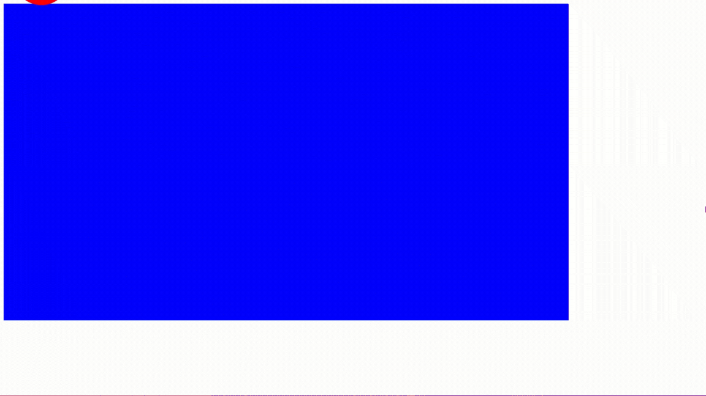

# Animated Box Project

This project consists of a simple web animation where a box moves across the screen both horizontally and vertically within a container.

## Project Description

The animation is created using HTML and CSS. The `.box` class represents a circular, red-colored box that moves from the bottom left of the `.container` to the top right, repeatedly.

## How It Works

The `.box` uses CSS animations with `@keyframes` to define the path of the movement. There are two animations applied:
- `animateX` for horizontal movement across the full width of the container.
- `animateY` for vertical movement from the bottom to the top of the container.

These animations are set to run infinitely, with `animateX` having a linear motion and `animateY` having an ease-out effect.

## Sample Animation

## HTML Structure

The HTML consists of a `div` element with the class `.container` which contains another `div` element with the class `.box`.

## CSS Styles

The CSS defines the size, position, and color of the `.box` and `.container`, as well as the animations.

## Usage

To view the animation, open the `index.html` file in a web browser.

## License

MIT